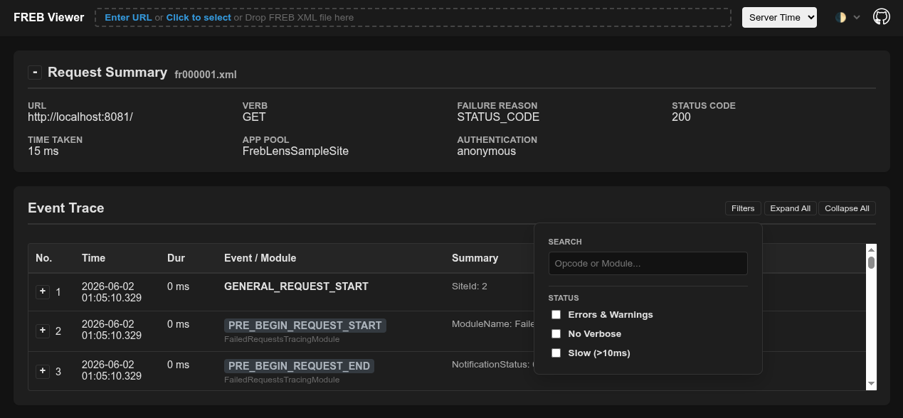

# FREB Viewer

FREB Viewer is a Microsoft IIS Failed Request Tracing (FREB) file viewer for modern web browsers.

## Features

- **No Server or Installation Required**: A single HTML file runs entirely in the browser without the need for server-side processing.
- **Browser Compatibility**: Renders XML-based FREB files in modern browsers (Chrome, Firefox, Edge, Safari, etc.).
- **Visual Analysis**: Transforms raw trace logs into a readable, interactive format.
- **Lightweight**: Client-side rendering for quick inspection of IIS issues.
- **URL/File/Drag-and-Drop Support**: Easily load FREB files by providing a URL, selecting a file or dragging them into the browser window.
- **Light/Dark/Auto Theme**: Switch between light and dark themes or let the viewer adapt to your system preferences.
- **Open Source**: Freely available under the MIT License.

## Prerequisites

- A modern web browser.
- IIS FREB XML files for analysis.

## Usage

Open [FrebViewer.html](https://plechenko.github.io/FrebViewer/FrebViewer.html) in your browser and select or drop a FREB XML file for analysis.

Want to try on some real life examples? You can grab a bunch of sample FREB files from the [samples/](https://github.com/plechenko/FrebViewer/tree/main/samples/) directory.

FREB Viewer supports drag-and-drop of FREB files from your file system, as well as selecting files via the file selection dialog or entering a URL. While entering a URL you can provide partial url name like: `samples/fr000001.xml`. You can also specify the url via query string parameter like `?url=samples/fr000001.xml` to open the viewer directly with a specific FREB file.

## Contributing

Any contributions are welcome! Please fork the repository and submit pull requests for any improvements or bug fixes.

## License

This project is licensed under the [MIT License](LICENSE).
